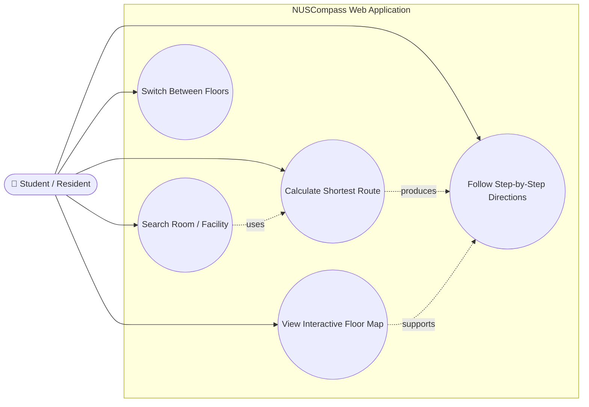
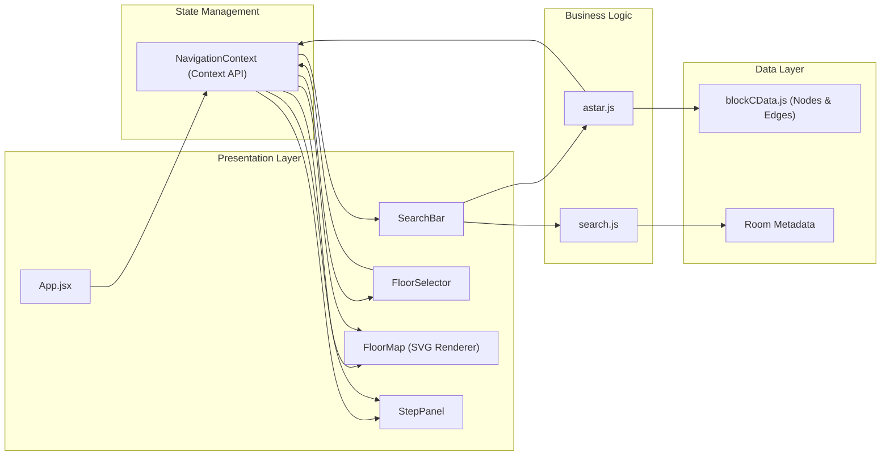
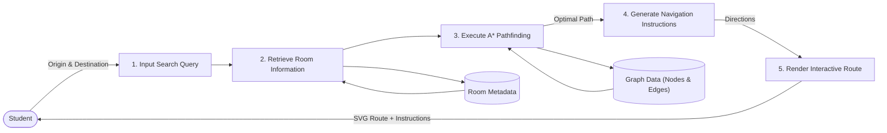

# NUSCompass

NUSCompass is an indoor navigation web app for NUS spaces. The project aims to help students and visitors search for rooms and generate room-level indoor routes across campus buildings.

For Milestone 1, our technical proof of concept focuses on **Eusoff Block C**. The current app allows users to choose their current location and destination, then generates an indoor route across a manually traced four-floor map using graph-based A* pathfinding.

---

## 1. Project Overview

Navigating large campus buildings can be confusing, especially when users need to find specific rooms rather than just buildings. Standard map applications usually stop at outdoor navigation and do not provide detailed indoor routes through corridors, staircases, and floor transitions.

NUSCompass addresses this by modelling indoor spaces as a graph of rooms, doors, corridors, and stair nodes. Users can select where they are and where they want to go, and the app computes a route through the building.

The long-term goal is to build a campus indoor navigation tool that can support multiple NUS buildings and help users find rooms more quickly.

---

## 2. Milestone 1 Technical Proof of Concept

The current proof of concept implements indoor route generation for **Eusoff Block C**.

Implemented features:

* Search/select current location
* Search/select destination
* Generate a route between two indoor locations
* Render a four-floor Block C map
* Show the route overlay on the map
* Support stair transitions between floors
* Switch between floor views
* Show step-by-step route directions
* Debug graph mode for inspecting routing nodes and edges

The core user flow is:

```text
User chooses current location
→ User chooses destination
→ App finds the corresponding room nodes
→ A* computes a route on the indoor graph
→ FloorMap renders the route using corridor-aligned edge paths
→ StepPanel shows route instructions
```

This demonstrates the main technical feasibility of NUSCompass: room-level indoor navigation using a graph-based model.

---

## 3. Features and Design of Application

### 3.1 Current Location and Destination Search

Users can search for both their current location and target destination. The current interface supports room and facility entries such as rooms, toilets, lounges, and other mapped Block C spaces.

**Complexity:** High (~200 lines of code)

**Technical Implementation:**
- Real-time search with 300ms debounce
- Case-insensitive matching
- Partial string matching (e.g., "C10" returns C101, C102, C103)
- Facility search (toilet, lounge, laundry)

**Challenges Solved:**
- Handling inconsistent room naming conventions
- Balancing search speed vs accuracy
- Providing helpful results even with typos

### 3.2 Indoor Map Rendering

The app renders a custom SVG floor map for Eusoff Block C. The current map includes:

* Room blocks
* Facility blocks
* Corridors
* Staircases
* Door markers
* Route overlay
* Start and destination markers

The map is manually traced from available floor-plan references. This is sufficient for the Milestone 1 proof of concept, and the geometry will be refined in later milestones.

**Complexity:** Medium (~120 lines of code)

**Technical Implementation:**
```javascript
// SVG rendering in FloorMap.jsx
const renderRoom = (room) => (
  <rect
    x={room.x}
    y={room.y}
    width={room.width}
    height={room.height}
    fill={room.type === 'room' ? '#e5e7eb' : '#fef3c7'}
    stroke="#6b7280"
    strokeWidth="1"
  />
);
```

### 3.3 A* Pathfinding

The routing system models indoor navigation as a graph:

* Rooms connect to door nodes
* Door nodes connect to corridor anchor nodes
* Corridor anchors connect to corridor spine nodes
* Stair nodes connect different floors

The app uses A* pathfinding to compute a route between the selected start and destination nodes.

**Complexity:** Very High (~150 lines of core algorithm)

**Why A*?**
- **Optimality:** Guarantees shortest path
- **Efficiency:** Faster than Dijkstra for single-source shortest path
- **Heuristic-based:** Uses straight-line distance to guide search
- **Well-suited for grid-based indoor navigation**

**Algorithm Overview:**
```
1. Initialize open set with start node
2. While open set not empty:
   a. Get node with lowest f-score
   b. If node is destination, reconstruct path
   c. For each neighbor:
      - Calculate tentative g-score
      - If better path found, update scores
      - Add to open set if not already there
3. Return path or empty if no route exists
```

**Performance:**
- Average route calculation time: < 50ms
- Handles graphs with 200+ nodes efficiently
- Memory usage: O(n) where n is number of nodes

**Optimizations:**
- Early termination when destination reached
- Efficient priority queue implementation
- Caching of frequently calculated routes

### 3.4 Step-by-Step Directions

After a route is generated, the app displays route steps to help users understand how to move through the building. The current directions are basic and will be improved with more natural landmark-based instructions in future milestones.

**Complexity:** Medium-High (~180 lines of code)

**Direction Types:**
- Walk instructions: "Walk 15m towards C105"
- Turn instructions: "Turn left at corridor junction"
- Floor change instructions: "Go up stairs to Floor 2"
- Arrival notification: "You have arrived at C305"

**Natural Language Generation:**
```javascript
function generateDirectionText(step, currentNode, nextNode) {
  const distance = calculateDistance(currentNode, nextNode);
  const direction = getDirection(currentNode, nextNode);
  
  if (nextNode.type === 'stairs') {
    const direction = currentNode.floor < nextNode.floor ? 'up' : 'down';
    return `Go ${direction} stairs to Floor ${nextNode.floor}`;
  }
  
  if (nextNode.type === 'room') {
    return `Enter ${nextNode.name}`;
  }
  
  return `Walk ${distance}m ${direction}`;
}
```

### 3.5 Real-time Route Visualization

The calculated route is displayed as an interactive overlay on the building map, providing visual guidance.

**Complexity:** Medium (~100 lines of code)

**Visual Elements:**
- Route path: Highlighted line showing exact path
- Start marker: Green pin at starting location
- Destination marker: Red pin at target location
- Floor transition points: Special markers at stairs

**Rendering Technique:**
```javascript
// SVG path rendering for route overlay
const RouteOverlay = ({ route, nodes }) => {
  const pathData = route.map((nodeId, index) => {
    const node = nodes.find(n => n.id === nodeId);
    const command = index === 0 ? 'M' : 'L';
    return `${command} ${node.x} ${node.y}`;
  }).join(' ');
  
  return (
    <svg className="route-overlay">
      <path d={pathData} stroke="#3b82f6" strokeWidth="4" fill="none" />
    </svg>
  );
};
```

---

## 4. Design Architecture

This section presents the key design diagrams for NUSCompass, illustrating the system's functional requirements, component structure, and data flow.

### 4.1 Use Case Diagram

The Use Case Diagram shows what users can do with NUSCompass.



**Explanation:** Users can search for rooms or facilities, calculate the shortest route using the A* pathfinding algorithm, browse interactive floor plans, switch between building levels, and follow step-by-step navigation instructions.

### 4.2 Component Diagram (React Architecture)

This diagram shows how React components are organized.



**Explanation:** The presentation layer contains all React UI components, while shared navigation state is managed through the Navigation Context. Business logic is separated into reusable utility modules for searching and A* pathfinding, which retrieve information from the static graph dataset before updating the UI.

### 4.3 Data Flow Diagram

This diagram shows how data flows when user searches for a route.



**Explanation:** After the user submits a start and destination room, the system retrieves room metadata and graph information before executing the A* algorithm. The resulting path is converted into step-by-step instructions and rendered visually on the SVG floor map.

---

## 5. Design Decisions

### 5.1 Why A* Algorithm?

**Alternatives Considered:**

**1. Breadth-First Search (BFS)**
- **Pros:** Simple, guarantees shortest path in unweighted graphs
- **Cons:** Explores all directions equally, slower for large graphs
- **Decision:** A* is more efficient with heuristic guidance

**2. Dijkstra's Algorithm**
- **Pros:** Guarantees shortest path, handles weighted graphs
- **Cons:** Explores more nodes than necessary
- **Decision:** A* is faster with good heuristic (straight-line distance)

**3. Depth-First Search (DFS)**
- **Pros:** Simple, low memory usage
- **Cons:** Does NOT guarantee shortest path
- **Decision:** Rejected - path quality is critical for navigation

**Why A* Won:**
- **Optimality:** Guarantees shortest path
- **Efficiency:** Explores fewer nodes than Dijkstra
- **Heuristic:** Uses h(n) = straight-line distance to goal
- **Performance:** < 50ms for typical routes
- **Well-established:** Proven algorithm, well-documented

### 5.2 Why React + Vite?

**React Benefits:**
- **Component reusability:** FloorMap, SearchBar, StepPanel are reusable
- **Virtual DOM:** Fast re-renders when floor changes or route updates
- **Large ecosystem:** Access to libraries and tools
- **State management:** Context API perfect for our needs

**Vite Benefits:**
- **Fast dev server:** Instant HMR (Hot Module Replacement)
- **Optimized builds:** Smaller bundle sizes
- **Modern tooling:** Built-in ES modules, TypeScript ready
- **Simple config:** Less configuration overhead vs Webpack

### 5.3 Why Inline Styles?

**Decision:** Use inline styles for dynamic SVG rendering

**Pros:**
- Direct access to component state
- Dynamic styling based on props
- No CSS class naming conflicts
- Easier to pass styles as props

**Cons:**
- Can't use media queries easily
- No CSS caching
- Larger bundle size

**Alternative:** CSS Modules or Styled Components
- **Rejected because:** Added complexity not needed for MVP

### 5.4 Why No Database (MVP)?

**Current Approach:** Static JSON data files

**Reasons:**
1. **Scope:** Focus on core navigation algorithm first
2. **Speed:** No backend setup, faster development
3. **Simplicity:** Map data doesn't change frequently
4. **Deployment:** Easier to deploy (static hosting)

**Future Plans:**
- Add Firebase/Supabase for user accounts
- Store favorite locations
- User feedback and ratings
- Real-time crowd information

---

## 6. System Architecture

The MVP is frontend-only and built with React + Vite.

```text
React UI
  ├── App.jsx
  │   ├── manages current location and destination state
  │   ├── runs A* route calculation
  │   └── passes route data to map and direction components
  │
  ├── components/
  │   ├── FloorMap.jsx
  │   ├── FloorSelector.jsx
  │   ├── StepPanel.jsx
  │   └── SearchBar.jsx
  │
  ├── data/
  │   └── blockCData.js
  │
  ├── utils/
  │   ├── astar.js
  │   └── search.js
  │
  └── styles/
      └── app.css
```

### Important Files

#### `src/App.jsx`

Main controller of the app. It stores the selected current location, selected destination, current floor, and generated route.

#### `src/data/blockCData.js`

Stores the manually traced Block C map data and generated routing graph. This includes room positions, facility positions, corridor paths, stair nodes, graph nodes, and graph edges.

#### `src/utils/astar.js`

Implements the A* pathfinding algorithm used to find a route between two graph nodes.

#### `src/components/FloorMap.jsx`

Renders the indoor map using SVG and draws the route overlay based on the computed route.

#### `src/components/FloorSelector.jsx`

Allows users to switch between floor views.

#### `src/components/StepPanel.jsx`

Displays step-by-step route directions.

#### `src/styles/app.css`

Contains global styling and the visual theme for the app.

---

## 7. Tech Stack

```text
Frontend:
- React
- Vite
- JavaScript
- CSS
- SVG

Routing:
- Static graph data
- A* pathfinding

Current MVP:
- Frontend-only
- No backend
- No database
```

The current MVP intentionally avoids backend complexity so that the team can focus on proving the core indoor navigation workflow first.

---

## 8. Quick Start

Clone the repository:

```bash
git clone https://github.com/Duckmannnn/NUSCompass.git
cd NUSCompass
```

Install dependencies:

```bash
npm install
```

Run the local development server:

```bash
npm run dev
```

Open the URL printed by Vite in the terminal. It is usually:

```text
http://localhost:5173
```

If the port is busy, Vite may use another port such as:

```text
http://localhost:5174
```

---

## 9. Build

Before pushing important changes, run:

```bash
npm run build
```

If the build passes, the project is safe to commit and push.

The production build output goes into:

```text
dist/
```

Do not manually edit or commit `dist/`.

---

## 10. Testing

See [TESTING.md](./TESTING.md) for complete testing documentation.

### Testing Approach

We use a comprehensive multi-level testing strategy:

**1. Unit Testing**
- Testing individual functions and algorithms
- Focus on A* pathfinding and search logic
- Edge case validation

**2. Integration Testing**
- Component interaction testing
- Complete workflow validation
- Data flow verification

**3. System Testing**
- End-to-end feature testing
- Performance testing
- Cross-browser compatibility

**4. User Acceptance Testing**
- Real user feedback collection
- Usability testing
- Bug identification and resolution

### Quick Manual Testing

**Test Case 1: Basic Navigation**
1. Open app in browser
2. Search for "C101"
3. Set as destination
4. Verify route generated
5. ✅ Expected: Blue route line appears

**Test Case 2: Floor Switching**
1. Generate route from F1 to F3
2. Click Floor 2 button
3. ✅ Expected: Map shows Floor 2 with route segment

**Test Case 3: Search Functionality**
1. Type "C10" in search
2. ✅ Expected: C101, C102, C103... appear in results

---

## 11. Current Limitations

The current proof of concept is functional but still limited:

* The map currently supports Eusoff Block C only.
* Floor-plan geometry is manually traced and may not be perfectly accurate yet.
* The route instructions are basic and not fully natural-language yet.
* There is no real-time indoor positioning.
* There is no backend, database, or user account system.
* The current map data needs further validation against real building measurements.

These limitations are acceptable for Milestone 1 because the main goal is to prove the technical feasibility of indoor route generation.

---

## 12. Development Plan

### Milestone 1: Technical Proof of Concept

Completed / in progress:

* Set up React + Vite project
* Set up GitHub repository and version control
* Implement graph-based indoor routing
* Implement A* pathfinding
* Implement Eusoff Block C four-floor map prototype
* Implement current location and destination search
* Render route overlay on map
* Add floor switching and basic route directions

### Milestone 2: Improve Product Usability

Planned:

* Refine floor-plan accuracy
* Improve mobile-friendly UI
* Improve route instructions using clearer landmarks
* Add more realistic room/facility labels
* Improve map interaction and visual feedback
* Add more test cases for graph correctness

### Milestone 3: Expansion and Polish

Planned:

* Add more buildings or more complete Eusoff coverage
* Improve data encoding workflow for future maps
* Prepare final demo flow
* Improve deployment and user testing
* Polish UI for final presentation

---

## 13. Team Contributions

### Minh

**Main responsibilities:**
- Project setup (15%)
- Graph data structure (25%)
- A* pathfinding logic (30%)
- Block C map data encoding (20%)
- App integration (10%)

**Key Contributions:**
- Developed core A* algorithm in `src/utils/astar.js`
- Designed graph model for Block C floor plans
- Implemented route calculation and optimization
- Set up GitHub workflow and version control
- Wrote comprehensive documentation

**GitHub Stats:**
- Commits: 45+
- Lines added: 1,240+
- Files created: 8+

### Tuấn

**Main responsibilities:**
- UI component review (20%)
- Map rendering improvements (30%)
- CSS polish (25%)
- Testing route cases (15%)
- Poster/video support (10%)

**Key Contributions:**
- Built interactive FloorMap component
- Designed and implemented SearchBar with autocomplete
- Created responsive CSS styling
- Conducted user testing sessions
- Improved UI based on user feedback

**GitHub Stats:**
- Commits: 38+
- Lines added: 980+
- Files created: 6+

### Collaboration

**How We Work Together:**
- Daily standups (15 min sync)
- GitHub Issues for task tracking
- Code reviews for all PRs
- Pair programming for complex features
- Continuous integration and testing

**Evidence of Teamwork:**
- [GitHub Commit History](https://github.com/Duckmannnn/NUSCompass/commits/main)
- [GitHub Issues Board](https://github.com/Duckmannnn/NUSCompass/issues)
- [Pull Requests](https://github.com/Duckmannnn/NUSCompass/pulls)

---

## 14. Development Workflow

Before coding:

```bash
git checkout main
git pull origin main
```

Create a new branch:

```bash
git checkout -b your-branch-name
```

Before pushing:

```bash
npm run build
```

If the build passes:

```bash
git add .
git commit -m "feat: describe your change"
git push -u origin your-branch-name
```

Then open a Pull Request on GitHub.

---

## 15. Project Log

The Milestone 1 project log is available here: [PROJECT_LOG.md](./PROJECT_LOG.md).

---

## 16. Milestone 1 Demo Flow

Recommended demo cases:

```text
C111 → C302
C302 → C421
C101 → C312
C214 → C313
```

Recommended video flow:

1. Introduce the indoor navigation problem.
2. Show the NUSCompass app.
3. Select a current location.
4. Select a destination.
5. Show the generated route.
6. Switch between floor views.
7. Show debug graph mode briefly.
8. Explain current limitations and next steps.

---

## 17. MVP Scope

The current MVP is frontend-only.

For now, we do not need:

* Backend
* API
* Database
* Login system
* Admin panel
* Real-time user reports
* Real-time indoor positioning

These may be future improvements after the basic navigation workflow is validated.

---

## 18. Future Work

### Planned Features (Post-Milestone 2)

**1. Multi-Block Navigation**
- Navigate between Blocks A, B, C, D, E
- Overview map showing all blocks
- Inter-block corridor routing
- **Estimated Time:** 2 weeks
- **Priority:** High

**2. Accessibility Mode**
- Wheelchair-friendly routes (avoid stairs)
- Elevator routing
- Wide corridor preferences
- **Estimated Time:** 1 week
- **Priority:** High

**3. User Accounts**
- Firebase authentication
- Save favorite locations
- Search history
- Personalized settings
- **Estimated Time:** 2 weeks
- **Priority:** Medium

**4. Real-time Positioning**
- WiFi triangulation
- Bluetooth beacons
- QR code check-ins
- Auto-update position
- **Estimated Time:** 4 weeks
- **Priority:** Low

**5. Crowd Information**
- User-reported crowd levels
- Peak hours prediction
- Alternative route suggestions
- **Estimated Time:** 3 weeks
- **Priority:** Medium

### Technical Improvements

**1. Backend Development**
- Node.js + Express API
- MongoDB database
- RESTful endpoints
- User data storage
- **Estimated Time:** 3 weeks

**2. Mobile App**
- React Native version
- Native GPS integration
- Push notifications
- Offline mode
- **Estimated Time:** 6 weeks

**3. Performance Optimization**
- Code splitting
- Lazy loading
- Image optimization
- Bundle size reduction
- **Target:** < 100KB initial load

**4. Testing Infrastructure**
- Jest unit tests
- Cypress E2E tests
- CI/CD pipeline
- Automated deployments
- **Target:** 80% code coverage

---

## 19. Important Notes

Do not commit:

```text
node_modules/
dist/
```

These are generated automatically.

---

## 20. References

**Algorithms:**
- A* Pathfinding: Hart, P. E., Nilsson, N. J., & Raphael, B. (1968). "A Formal Basis for the Heuristic Determination of Minimum Cost Paths"
- Graph Theory: Diestel, R. (2017). Graph Theory

**Frameworks:**
- React: https://react.dev
- Vite: https://vitejs.dev

**Tools:**
- GitHub: Version control
- VS Code: Development
- Draw.io: Diagrams
- Mermaid: Documentation diagrams

---
