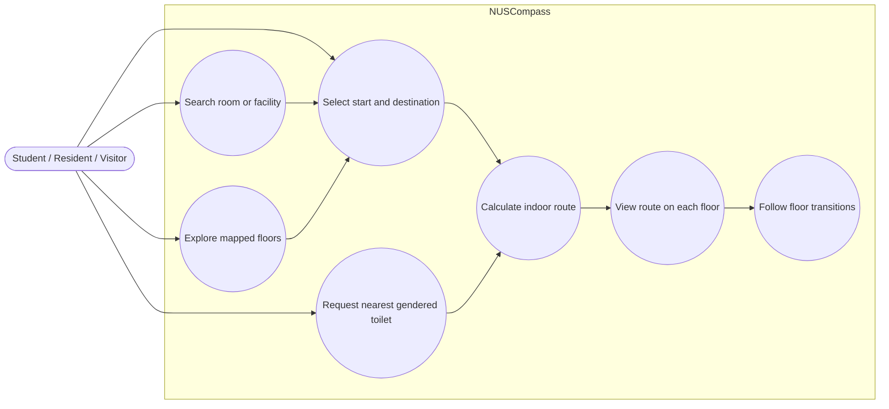
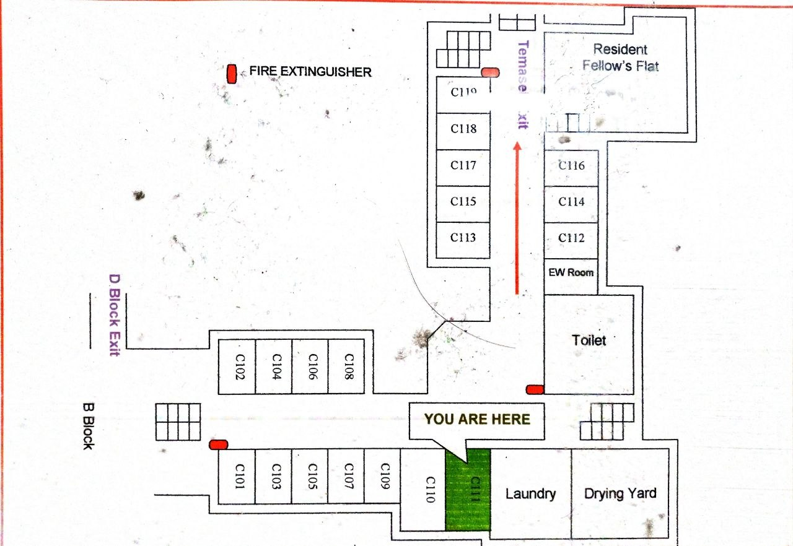
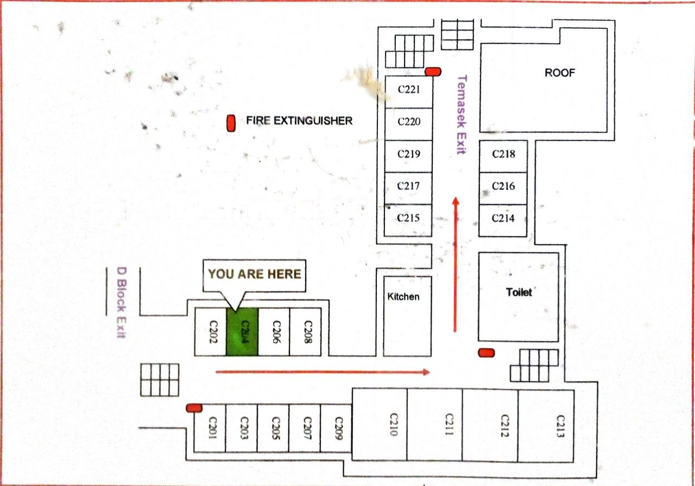
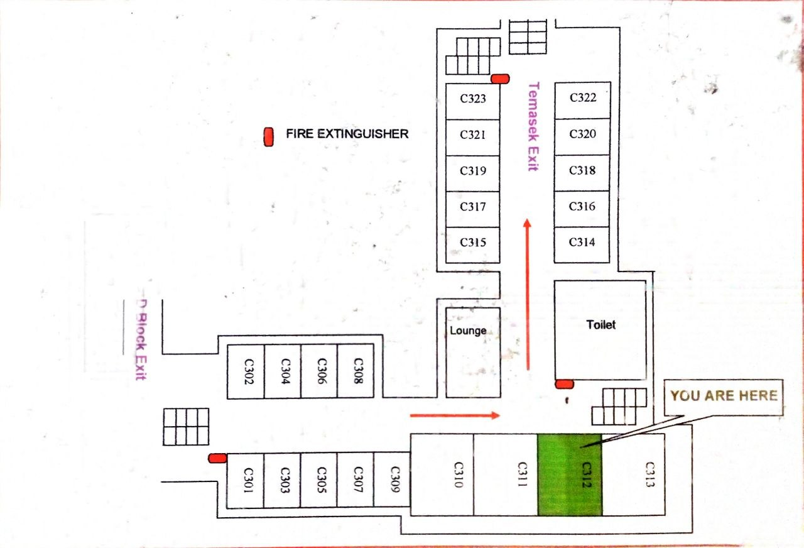
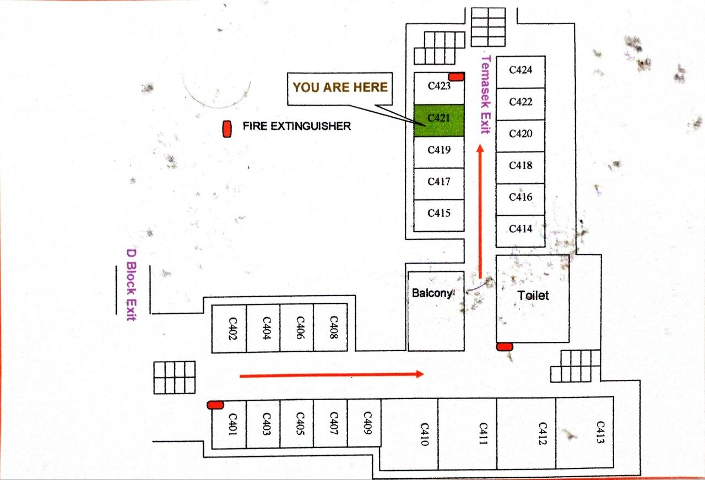
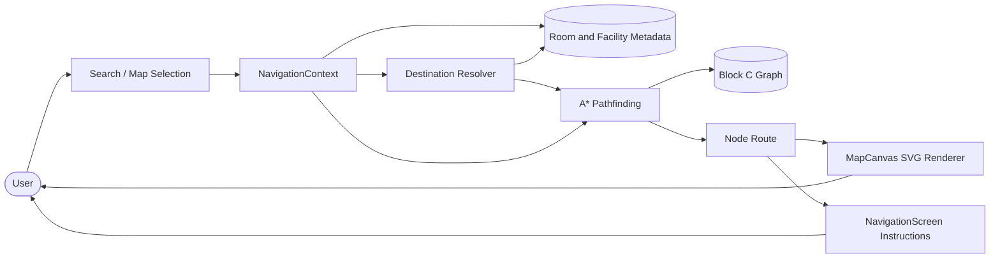
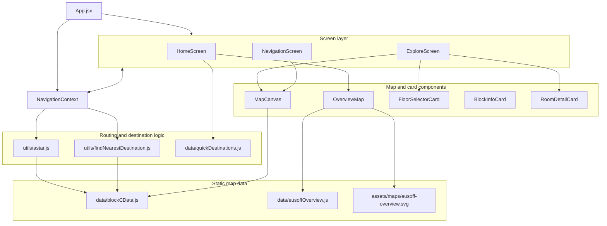

# NUSCompass

> **Interactive room-level navigation for Eusoff Hall, NUS**

[Live Demo](https://nus-compass.vercel.app/) · [Project Log](./PROJECT_LOG.md) · [Git History](https://github.com/Duckmannnn/NUSCompass/commits/main)


## README navigation

- [Idea and product direction](#1-idea-and-product-direction)
- [Technical design](#2-technical-design)
- [Development journey](#3-development-journey)
- [Main challenges and lessons](#4-main-challenges-and-lessons)
- [Team contributions](#team-contributions)
- [Current scope and limitations](#current-scope-and-limitations)
- [Running and demonstrating the project](#running-and-demonstrating-the-project)

## Project at a glance

| Item | Current implementation |
|---|---|
| Product type | Frontend indoor-navigation proof of concept |
| Mapped area | Eusoff Hall Block C, Floors 1–4 |
| Main stack | React, Vite, JavaScript, CSS and SVG |
| Routing | Weighted indoor graph with A* |
| Graph model | Doors, corridor anchors, corridor spines, junctions and stairs |
| Visual assets | Figma-traced floor plans and Eusoff overview SVG |
| State management | React Context through `NavigationContext` |
| Verification | Vitest, manual UI testing and GitHub Actions |
| Deployment | Vercel |
| Project record | [`PROJECT_LOG.md`](./PROJECT_LOG.md) and Git history |


NUSCompass is a working indoor-navigation proof of concept for **Eusoff Hall Block C**. It allows a user to search for a room or facility, select a starting point, calculate a route across multiple floors, and follow the result on an interactive SVG map.

The project combines three areas that are usually treated separately:

- **visual design**, through floor plans manually traced and refined in Figma;
- **graph modelling**, through door, corridor, junction and staircase nodes;
- **pathfinding**, through a tested A* implementation and route-specific product rules.

## What the current prototype can do

- Display an interactive overview of Eusoff Hall.
- Search mapped rooms and facilities in Block C.
- Explore four indoor floors.
- Select rooms and facilities directly from the map.
- Calculate same-floor and multi-floor routes.
- Render route lines along corridor geometry rather than as direct straight lines.
- Show floor transitions and navigation steps.
- Find the nearest mapped men's or women's toilet from a chosen starting point.
- Support mouse, keyboard, zoom and drag interactions.
- Run automated lint, test and production-build checks through GitHub Actions.
- Deploy the current `main` branch through Vercel.

The main achievement is not only that A* returns a list of nodes. The system connects the entire chain:

```text
real floor plan
    ↓
manually traced visual geometry
    ↓
indoor routing graph
    ↓
A* route calculation
    ↓
floor-by-floor SVG route
    ↓
interactive user interface
```

---

# 1. Idea and Product Direction

## Why indoor navigation?

Conventional map services are effective at bringing a user to a building. They normally stop being useful after the user enters it.

A student or visitor arriving at Eusoff Hall may still need to determine:

- which block contains the destination;
- which floor to use;
- which staircase connects the required floors;
- which corridor leads to the correct side of the building;
- where the actual room entrance is;
- which nearby facility is appropriate.

This is not a simple coordinate problem. A room may appear visually close to another room while the valid walking route goes around walls, through a corridor junction and across a different staircase.

NUSCompass was therefore designed around a more precise question:

> How can a web application represent a real indoor building well enough to calculate and explain valid room-to-room routes?

## Why start with Block C?

The team initially considered supporting multiple Eusoff blocks. However, mapping one block correctly required much more work than placing several rectangles on an overview screen.

Every additional block would require:

- a floor plan with consistent scale;
- correct room placement for every floor;
- doors and corridor boundaries;
- staircase and inter-block connections;
- a routing graph;
- route-rendering paths;
- search metadata;
- manual route testing;
- changes to the data architecture so that the code was not tied only to Block C.

The team experimented with extending the work to another block, including attempts to redraw Block B. Those attempts exposed problems with inconsistent coordinates, incorrect floor placement, stair geometry and the passage connecting the blocks.

Instead of presenting inaccurate coverage, the team chose to complete one block as a strong end-to-end proof of concept. The overview still displays the intended wider Eusoff Hall scope, but only Block C is marked as mapped.

## Product flow

The current user flow is:

1. Open the Eusoff Hall overview.
2. Search for a room or facility, or select Block C.
3. Explore one of the four indoor floors.
4. Select a starting point and a destination.
5. Calculate the route.
6. View the route segment on the relevant floor.
7. Move through the ordered floor transitions.

A normal destination is a known room or facility. A quick destination such as the nearest men's toilet is stored as an **intent**, because the actual destination cannot be determined until the starting room is known.

### Use-case diagram


```mermaid
flowchart LR
    User([Student / Resident / Visitor])

    subgraph App["NUSCompass"]
        U1((Search room or facility))
        U2((Explore mapped floors))
        U3((Select start and destination))
        U4((Request nearest gendered toilet))
        U5((Calculate indoor route))
        U6((View route on each floor))
        U7((Follow floor transitions))
    end

    User --> U1
    User --> U2
    User --> U3
    User --> U4

    U1 --> U3
    U2 --> U3
    U3 --> U5
    U4 --> U5
    U5 --> U6
    U6 --> U7
```

This diagram describes the current application rather than the original Milestone 1 interface. Search and map exploration both lead into shared navigation state; a quick destination is resolved only after a starting point is available.

---

# 2. Technical Design

## 2.1 From Figma floor plans to SVG map data

### Early approach: generating the map directly in code

The first indoor map was generated from arrays of rooms and approximate coordinates. React rendered rectangles for rooms and lines for graph edges.

This approach was useful because it made the first prototype quick to build. It proved that:

- room data could be loaded;
- floors could be switched;
- A* could return a route;
- the route could be displayed.

However, it was not visually accurate enough.

The generated rooms did not preserve the real proportions of the reference plans. More importantly, connecting two graph points directly created route lines that looked rough and could visually cross rooms or walls.

```text
Early rendering:

point A ───────────────── point B

Problem:
the line represented graph connectivity,
but not necessarily the real corridor.
```

### Upgraded approach: manually tracing in Figma

The floor plans were then manually traced and refined in Figma. This was a substantial upgrade over producing the full map from simple code-generated rectangles.

Manual tracing allowed the team to preserve:

- room proportions;
- corridor width and shape;
- unusual wall geometry;
- staircase locations;
- large facilities and special areas;
- relative placement between different parts of a floor.

The traced geometry was then translated into SVG-compatible data for the React map.

This changed the source of truth:

```text
Before:
approximate code-generated layout
    → graph placed on top

After:
manually traced visual layout
    → graph designed to follow the layout
```

The visual map and the navigation graph are still separate layers, but they now share the same coordinate system.

### Floor-plan and design artefacts

The repository keeps the four Block C floor-plan references used during tracing:

- [`public/maps/eusoff-c-f1.jpg`](./public/maps/eusoff-c-f1.jpg)
- [`public/maps/eusoff-c-f2.jpg`](./public/maps/eusoff-c-f2.jpg)
- [`public/maps/eusoff-c-f3.jpg`](./public/maps/eusoff-c-f3.jpg)
- [`public/maps/eusoff-c-f4.jpg`](./public/maps/eusoff-c-f4.jpg)

It also contains the Eusoff overview artwork used by the current Home screen:

- [`src/assets/maps/eusoff-overview.svg`](./src/assets/maps/eusoff-overview.svg)

<details>
<summary><strong>Open the original Block C floor-plan references</strong></summary>

<br>

| Floor 1 | Floor 2 |
|---|---|
|  |  |

| Floor 3 | Floor 4 |
|---|---|
|  |  |

</details>

These image files are references, not the runtime navigation graph. The runtime floor geometry and graph are encoded in [`src/data/blockCData.js`](./src/data/blockCData.js).

## 2.2 Visual map and routing graph

A valid indoor-navigation system needs both layers.

### Visual layer

The visual layer contains:

- room and facility shapes;
- labels;
- corridor polygons;
- outer walls;
- staircase shapes;
- door positions;
- selected-destination highlighting;
- rendered route paths.

### Routing layer

The graph contains:

- **door nodes** at room and facility entrances;
- **corridor anchors** that connect each door to walkable space;
- **corridor-spine nodes** along the main centre lines;
- **junction nodes** at turns and intersections;
- **stair nodes** for floor transitions;
- **directed weighted edges** between valid neighbouring nodes.

A simplified route is:

```text
room
  ↓
door node
  ↓
local corridor anchor
  ↓
corridor spine
  ↓
junction
  ↓
stair node
  ↓
next-floor stair node
  ↓
destination corridor
  ↓
destination door
```

This model was introduced because using the centre of a room as a routing node caused unrealistic route geometry. People do not walk from the centre of one room through walls to the centre of another; they enter and leave through doors.

## 2.3 Edge geometry and route rendering

Each graph edge has a cost and may also contain an ordered list of points:

```js
{
  from,
  to,
  distance,
  penalty,
  type,
  path: [
    { x, y },
    { x, y },
    ...
  ]
}
```

The numerical values are used by A*. The `path` is used by the SVG renderer.

This distinction solves two separate problems:

- A* needs a weighted topology.
- The UI needs a corridor-shaped line that users can understand.

`MapCanvas` takes the node route returned by A*, finds the matching edge geometry, extracts the continuous segment on the active floor and converts the points into an SVG path.

```text
A* result:
[node-1, node-2, node-3]

MapCanvas:
node-1 → node-2 edge.path
node-2 → node-3 edge.path

Result:
a route that follows the encoded corridor
```

### Route data-flow diagram


```mermaid
flowchart LR
    User([User])
    Search["Search / Map Selection"]
    Context["NavigationContext"]
    Rooms[("Room and Facility Metadata")]
    Graph[("Block C Graph")]
    Resolver["Destination Resolver"]
    AStar["A* Pathfinding"]
    Route["Node Route"]
    Canvas["MapCanvas SVG Renderer"]
    Guide["NavigationScreen Instructions"]

    User --> Search
    Search --> Context
    Context --> Rooms
    Context --> Resolver
    Resolver --> Rooms
    Resolver --> AStar
    Context --> AStar
    AStar --> Graph
    AStar --> Route
    Route --> Canvas
    Route --> Guide
    Canvas --> User
    Guide --> User
```

For an ordinary room, `NavigationContext` sends the selected start and destination nodes directly to A*. For a nearest-toilet intent, the resolver first evaluates candidate facilities and then invokes A* to compare reachable routes.

The renderer also handles:

- destination markers;
- staircase transitions;
- current-floor filtering;
- rooms, facilities and special destinations;
- pointer selection;
- Enter/Space keyboard selection;
- highlighted destination state.

## 2.4 A* pathfinding

The production algorithm is implemented in `src/utils/astar.js`.

For each route request, it:

1. validates the start and goal;
2. builds a node lookup;
3. builds an adjacency list from the graph's directed edges;
4. stores candidate nodes in a binary min-heap;
5. tracks the best known route cost with `gScore`;
6. adds a conservative floor-transition heuristic;
7. reconstructs the route when the goal is reached.

The edge cost is:

```text
distance + optional penalty
```

The heuristic is:

```text
absolute floor difference
× minimum known floor-transition cost
```

On the same floor, the heuristic is zero.

This conservative heuristic was chosen because the map coordinates come from a manually constructed indoor drawing. Using raw Euclidean distance too aggressively could overestimate the remaining route and weaken the guarantee that A* returns the cheapest encoded path.

### Why the algorithm had to be rewritten

The first A* version worked for the small prototype, but it made assumptions that became risky after the graph expanded:

- it scanned the whole open set instead of using a priority queue;
- it automatically made every edge bidirectional;
- it combined visual coordinate distance with a large floor penalty;
- it did not explicitly collapse duplicate edges;
- it did not guard route reconstruction against malformed cycles;
- correctness was judged mainly from a few visible demo routes.

The revised version:

- uses a binary min-heap;
- respects the directions already defined by graph data;
- keeps the cheapest duplicate edge;
- ignores invalid edge costs;
- skips stale heap entries;
- guards against cycles during reconstruction;
- uses a deliberately admissible floor heuristic.

### Why A* rather than BFS, DFS or plain Dijkstra?

| Algorithm | Suitable part | Limitation for this project | Decision |
|---|---|---|---|
| BFS | Simple unweighted graphs | Indoor edges have different distances and penalties | Rejected |
| DFS | Connectivity exploration | Does not guarantee the cheapest route | Rejected |
| Dijkstra | Correct weighted shortest paths | Explores without heuristic guidance | Used as an independent test oracle |
| A* | Weighted route search with safe guidance | Requires a carefully designed heuristic | Used in production |

The current implementation does **not** rely on straight-line distance as its main heuristic. Because the floor-plan coordinates were manually encoded, the production heuristic only estimates unavoidable floor-transition cost. Dijkstra remains useful in tests because it provides an independent reference without sharing A*'s heuristic.

## 2.5 Application architecture

### Initial architecture

The first application placed most behaviour inside `App.jsx`:

```text
search
route calculation
selected room
current floor
map
step list
debug output
```

This was efficient for a proof of concept because every value was available in one component.

It became difficult to maintain when the product added:

- a campus overview;
- an exploration screen;
- a separate navigation screen;
- room-detail overlays;
- map highlighting;
- quick destination intents;
- route loading and errors;
- state that had to survive screen transitions.

### Three-screen architecture

The application was therefore reorganised into:

```text
HomeScreen
    ├── overview map
    ├── global destination search
    └── quick destination intents

ExploreScreen
    ├── indoor floor map
    ├── floor selection
    └── room/facility details

NavigationScreen
    ├── start and destination selection
    ├── route calculation
    ├── floor instructions
    └── route controls
```

Shared state moved to `NavigationContext`.

The context stores:

```text
current screen
selected block
current floor
selected room
highlighted room
start room
destination room
destination intent
route
current route step
loading state
error state
active overlay
```

This change was not only for cleaner files. It was required because one interaction could begin on the Home screen and affect the map and route on two later screens.

For example:

```text
Home search result selected
    ↓
Block C selected
    ↓
correct floor opened
    ↓
destination saved
    ↓
room highlighted in Explore
    ↓
same destination available in Navigation
```

Without central state, each screen could display a different destination or retain outdated route information.

### Current React component architecture


```mermaid
flowchart TB
    App["App.jsx"]

    subgraph Screens["Screen layer"]
        Home["HomeScreen"]
        Explore["ExploreScreen"]
        Navigation["NavigationScreen"]
    end

    subgraph SharedUI["Map and card components"]
        Overview["OverviewMap"]
        Canvas["MapCanvas"]
        FloorSelector["FloorSelectorCard"]
        BlockCard["BlockInfoCard"]
        RoomCard["RoomDetailCard"]
    end

    Context["NavigationContext"]

    subgraph Logic["Routing and destination logic"]
        AStar["utils/astar.js"]
        Nearest["utils/findNearestDestination.js"]
        Quick["data/quickDestinations.js"]
    end

    subgraph Data["Static map data"]
        BlockC["data/blockCData.js"]
        OverviewData["data/eusoffOverview.js"]
        OverviewSVG["assets/maps/eusoff-overview.svg"]
    end

    App --> Context
    App --> Screens

    Home --> Overview
    Home --> Quick
    Explore --> Canvas
    Explore --> FloorSelector
    Explore --> RoomCard
    Navigation --> Canvas

    Screens <--> Context
    Context --> AStar
    Context --> Nearest

    AStar --> BlockC
    Nearest --> BlockC
    Overview --> OverviewData
    Overview --> OverviewSVG
    Canvas --> BlockC
```

### Current project structure

```text
NUSCompass/
├── .github/
│   └── workflows/
│       └── ci.yml
├── public/
│   └── maps/
│       ├── eusoff-c-f1.jpg
│       ├── eusoff-c-f2.jpg
│       ├── eusoff-c-f3.jpg
│       └── eusoff-c-f4.jpg
├── src/
│   ├── assets/
│   │   └── maps/
│   │       └── eusoff-overview.svg
│   ├── components/
│   │   ├── cards/
│   │   └── map/
│   │       ├── MapCanvas.jsx
│   │       └── OverviewMap.jsx
│   ├── context/
│   │   └── NavigationContext.jsx
│   ├── data/
│   │   ├── blockCData.js
│   │   ├── eusoffOverview.js
│   │   └── quickDestinations.js
│   ├── screens/
│   │   ├── HomeScreen.jsx
│   │   ├── ExploreScreen.jsx
│   │   └── NavigationScreen.jsx
│   ├── utils/
│   │   ├── astar.js
│   │   ├── astar.test.js
│   │   ├── findNearestDestination.js
│   │   └── findNearestDestination.test.js
│   ├── App.jsx
│   └── main.jsx
├── PROJECT_LOG.md
├── README.md
├── package.json
└── vite.config.js
```

The exact file list may continue to evolve, but the important architectural boundary is stable: screens handle workflows, the context coordinates state, utility modules perform routing, and static data describes the mapped building.

## 2.6 Overview-map interaction

The first overview was a simple schematic generated in code. It helped test screen navigation, but it did not match the intended visual design.

The final overview uses a detailed SVG visual layer and a separate React interaction layer. It supports:

- fit-to-container behaviour;
- wheel zooming around the pointer;
- drag-to-pan;
- a movement threshold to distinguish dragging from clicking;
- suppression of the click fired immediately after a drag;
- reset and zoom controls;
- keyboard selection;
- mapped and unmapped block states.

Keeping the SVG image separate from the interactive hit areas made the design easier to refine without embedding all React events directly into the original artwork.

## 2.7 Nearest gendered toilet

The nearest-toilet feature is not implemented as a hard-coded room.

The home and navigation searches can create an intent such as:

```js
{
  type: 'nearest-toilet',
  toiletGender: 'male'
}
```

After the user selects a starting room, the resolver:

1. finds all mapped toilets of the requested gender;
2. groups them by absolute floor difference;
3. checks the closest floor group first;
4. runs A* for every candidate in that group;
5. compares actual graph-route cost;
6. falls back to a farther group only if the closer group is unreachable.

This policy was added after testing revealed that a globally cheaper graph route could send a user from Floor 3 down to the Floor 1 men's toilet instead of up to Floor 4. Although the original result followed its cost function, it did not match the floor behaviour users expected.

## 2.8 Testing and delivery

The repository uses Vitest for automated checks.

The tests cover:

- missing start and goal nodes;
- start equal to goal;
- invalid graph coordinates or edge costs;
- destinations without graph nodes;
- same-floor and multi-floor routes;
- route connectivity;
- route-cost comparison against a separate Dijkstra reference;
- deterministic random route cases;
- unreachable destinations;
- toilet gender filtering;
- nearest-floor toilet regression cases.

Manual testing remained necessary for:

- map readability;
- corridor alignment;
- room selection;
- highlight behaviour;
- screen transitions;
- button states;
- whether the route looked reasonable to a user.

This was an important part of Tuấn's contribution. Automated tests could check graph correctness, while UI review and manual route testing identified visual and state problems that a shortest-path test could not detect.

GitHub Actions runs:

```bash
npm ci
npm run lint
npm test
npm run build
```

The current frontend is deployed on Vercel.

Relevant automated tests can be inspected directly:

- [`src/utils/astar.test.js`](./src/utils/astar.test.js)
- [`src/utils/findNearestDestination.test.js`](./src/utils/findNearestDestination.test.js)


```mermaid
flowchart LR
    Change["Code or data change"]
    Manual["Manual UI and route review"]
    Lint["ESLint"]
    Tests["Vitest"]
    Build["Vite production build"]
    PR["Pull request"]
    CI["GitHub Actions"]
    Merge["Merge to main"]
    Deploy["Vercel deployment"]

    Change --> Manual
    Manual --> Lint
    Lint --> Tests
    Tests --> Build
    Build --> PR
    PR --> CI
    CI --> Merge
    Merge --> Deploy
```

---

# 3. Development Journey

The following history groups commits by what they changed. Some commits contain much more work than their short titles suggest.


```mermaid
flowchart LR
    Scaffold["React/Vite scaffold"]
    Prototype["A* + room search"]
    GraphView["Abstract graph visualiser"]
    CodeMap["Code-generated Block C map"]
    TracedMap["Figma-traced floor geometry"]
    GraphRefactor["Door-anchor-corridor graph"]
    ThreeScreens["Three-screen architecture"]
    Interactive["Interactive overview and MapCanvas"]
    Tested["Vitest + A* hardening"]
    Dynamic["Nearest-toilet destination intents"]
    Delivered["CI + Vercel"]

    Scaffold --> Prototype
    Prototype --> GraphView
    GraphView --> CodeMap
    CodeMap --> TracedMap
    TracedMap --> GraphRefactor
    GraphRefactor --> ThreeScreens
    ThreeScreens --> Interactive
    Interactive --> Tested
    Tested --> Dynamic
    Dynamic --> Delivered
```

## Stage 1 — Proving that indoor routing was possible

### `feat: implement astar`

[View commit](https://github.com/Duckmannnn/NUSCompass/commit/770fd984d862b28134af4dc4a299f2d50d2e7a41)

**What it actually introduced**

- weighted graph traversal;
- adjacency lists;
- `gScore` and `fScore`;
- a multi-floor heuristic;
- route reconstruction.

**Why it mattered**

Before this commit, the repository mainly contained a React scaffold and placeholder utilities. This commit answered the first technical question: whether the app could generate a route through an indoor graph at all.

**What it still lacked**

- a real building graph;
- user-selected starting points;
- visual route rendering;
- automated correctness tests.

### `feat: implement room search utility`

[View commit](https://github.com/Duckmannnn/NUSCompass/commit/e5b658abf34a510b852e0cf33784682ee6810741)

This normalised room metadata and allowed users to search by several fields instead of directly entering graph-node IDs.

### `feat: connect room search to route generation`

[View commit](https://github.com/Duckmannnn/NUSCompass/commit/a7cbc8df0210f9685491c8a275569431afca0e59)

This connected the search result to A*. The route was still calculated from a fixed entrance and mainly displayed as node IDs.

The first working chain was therefore:

```text
room search → destination node → A* → node list
```

## Stage 2 — Creating the first complete visual demo

### `feat: complete milestone 1 navigation demo`

[View commit](https://github.com/Duckmannnn/NUSCompass/commit/863ad20abd3a0dd6f5dcdc7df5fd80c028dc278a)

**What it did**

- added `FloorMap`;
- added a floor selector;
- rendered route nodes and straight graph edges;
- added basic step instructions;
- organised the first complete interface.

**Why the next redesign was needed**

The commit produced a demonstrable application, but the map was still a graph visualiser rather than a faithful floor plan.

The line between two points could be valid for the graph while looking visually wrong:

```text
graph says: connected
UI shows: a thick straight line through a room
```

That limitation motivated the move from approximate code-generated maps to manually traced geometry.

## Stage 3 — Encoding a real Block C map

### `feat: add Block C navigation data model`

[View commit](https://github.com/Duckmannnn/NUSCompass/commit/0f871a6ca552f00b5a1213c2bc212329bef51919)

This was the first large Block C model. It added four floors, rooms, facilities, stairs, nodes and weighted edges.

It was an important step, but the geometry was still largely produced from repeated coordinate patterns. Real floor plans contain irregular widths, offsets and connections that do not fit one generic room generator.

### `feat: render Block C SVG floor map with routed edge paths`

[View commit](https://github.com/Duckmannnn/NUSCompass/commit/f231ea4327721aa2567a0b9332fe96deaedf5da2)

This separated graph cost from visual route geometry.

Instead of rendering every route segment as one straight SVG line, the map could use the points stored in `edge.path`.

### `refactor: rebuild Block C graph with door nodes and corridor spines`

[View commit](https://github.com/Duckmannnn/NUSCompass/commit/68a72562e7f471498a7cce6c2c0a66aff1f05bfa)

The first graph still connected rooms too coarsely. This refactor added:

- door nodes;
- corridor anchors;
- corridor-spine nodes;
- more explicit junctions;
- facility door access;
- paths aligned to the corridor.

This architecture exists because the shortest route must begin at a room entrance, not at the centre of a room rectangle.

### `feat: add traced Block C floor maps and indoor routing graph`

[View commit](https://github.com/Duckmannnn/NUSCompass/commit/8207c661f027c1f5c8df5dae8dfe0860f12fdb02)

This commit replaced much of the earlier approximate layout with coordinates derived from the manually traced floor plans.

**Why this was an upgrade**

The previous code-generated layout optimised for repeated patterns. The traced layout prioritised the original floor-plan proportions and then rebuilt the graph on top of them.

The commit also documented a clearer rule:

> The visual floor plan is the source of truth; the navigation graph is built on top of it.

### `feat: complete Block C indoor routing proof of concept`

[View commit](https://github.com/Duckmannnn/NUSCompass/commit/e533001215d1f0b722d66b02cf66c7766a52e210)

This completed the first realistic Block C loop by allowing both the starting location and destination to be selected and by improving markers, stairs, facilities and route behaviour.

## Stage 4 — Replacing the monolithic interface

### `fix`

[View commit](https://github.com/Duckmannnn/NUSCompass/commit/d56f827bada6f5ef5337f424937c12e92540e76e)

The title understates the change.

This commit removed most routing and search logic from the single `App.jsx` component and introduced:

- `NavigationContext`;
- Home, Explore and Navigation screens;
- shared screen and navigation state;
- initial card overlays.

This was effectively an architecture migration, not a minor fix.

The change was needed because the single-screen prototype could no longer support separate overview, exploration and navigation workflows without duplicating or losing state.

### `feat: implement M2 3-screen architecture with card overlays`

[View commit](https://github.com/Duckmannnn/NUSCompass/commit/c1e030947ab393112a61422e6056e7e5d8c9b90a)

This completed and integrated the three-screen structure with the real Block C graph and A* route calculation.

The commit also created explicit points for UI implementation, making it possible for Tuấn to work on cards, screens and map interaction while Minh continued routing and integration work.

### `add cards for room and block info`

[View commit](https://github.com/Duckmannnn/NUSCompass/commit/eda74c14b4ee941ec0393662fb3354d163d977d4)

This improved the product flow by giving selected blocks and rooms a visible information state before navigation began.

## Stage 5 — Iterating on UI, flow and overview design

### `feat: implement overview map and fix critical bugs`

[View commit](https://github.com/Duckmannnn/NUSCompass/commit/9f42fedbfb504bb46a311d20eb9cf881d20ec4d9)

This was another multi-purpose commit. It included:

- the first overview-map component;
- a fix for a persistent glow/highlight behaviour on the Home screen;
- a route-calculation loading state;
- memoisation of generated step guidance;
- removal of debug logging;
- clearer placeholder text;
- styling improvements to cards and floor controls.

The changes show that UI work was not only visual polish. Adding more screens exposed state and performance problems that did not exist in the first single-screen demo.

### `fix bug graph và flow UI`

[View commit](https://github.com/Duckmannnn/NUSCompass/commit/9439a6c95b3316534d508e6853798149d4e46ec9)

This commit grouped many smaller corrections, including work around:

- graph and route integration;
- block availability;
- floor selection;
- room-detail fallbacks;
- closing overlays;
- clearing map highlights;
- navigation-state flow;
- route display and screen transitions.

The generic title makes these changes easy to overlook, but together they stabilised the relationship between the graph and the UI.

### `fix bug and make overview screen`

[View commit](https://github.com/Duckmannnn/NUSCompass/commit/10de03a14cd736dbf79db58f84b1b218564a84f4)

This introduced a fuller overview screen and connected it to search and block selection.

The first overview was still schematic, which later motivated the manually prepared Eusoff SVG.

### `feat(map): add Eusoff overview SVG and map data`

[View commit](https://github.com/Duckmannnn/NUSCompass/commit/323e51e94c7c8f1f08a7356092c519eaa474f0de)

This added the detailed overview artwork and metadata required to place interactive building regions on it.

### `feat(ux): integrate interactive overview navigation flow`

[View commit](https://github.com/Duckmannnn/NUSCompass/commit/cd37117c88fb6813fe485f6482a0793b631bf3b8)

This turned the overview from a static image into a navigable workspace.

The commit added:

- fit-to-window calculations;
- zooming;
- dragging;
- resize handling;
- drag-versus-click detection;
- mapped-block interaction;
- keyboard access;
- the connection from overview selection to Block C exploration.

### `fix(map): enable destination selection and highlighting`

[View commit](https://github.com/Duckmannnn/NUSCompass/commit/46d610bb6d9d67ff4ff3f27ff4a2c2c3d269b829)

This unified room, facility and special-destination interaction.

It also corrected several rendering details:

- exact edge lookup;
- reverse-path fallback for display;
- safe handling of missing layout arrays;
- destination highlighting;
- pointer and keyboard activation;
- floor-route segmentation;
- staircase direction markers.

This commit is closely connected to Tuấn's UI/UX work and map-interaction testing.

## Stage 6 — Making route correctness repeatable

### `test(vitest): configure baseline test environment`

[View commit](https://github.com/Duckmannnn/NUSCompass/commit/099935207510a60ba1e0af84344628405cf89e83)

Before this stage, the team mainly checked routes by opening the application and testing selected cases manually.

This commit established a repeatable automated-test environment.

### `feat(routing): optimize A* with min heap and add tests`

[View commit](https://github.com/Duckmannnn/NUSCompass/commit/d6cfdb172547acbf6365b4d16ff26bd1b31d1e7c)

This commit rewrote core parts of A* and added a much stronger correctness suite.

The test suite did not merely check that a route existed. It also compared route costs with an independent Dijkstra implementation and generated deterministic random route cases across the real graph.

### `chore: restore lint config and fix lint errors`

[View commit](https://github.com/Duckmannnn/NUSCompass/commit/5040635143472ad7cf21159c0803ece6f0ef968d)

This restored static checks after architectural and testing branches were combined. It prevented style and code-quality issues from silently accumulating during the large merge.

## Stage 7 — Adding a destination resolved at runtime

### `add functionality for gendered toilets`

[View commit](https://github.com/Duckmannnn/NUSCompass/commit/c9e5d2b8f15ec1535647992298f6b76b5dc6491b)

This commit added:

- gender metadata to toilets;
- quick destination search entries;
- destination-intent state;
- candidate filtering;
- route-cost calculation;
- nearest-toilet tests;
- integration with Home and Navigation screens.

It was different from an ordinary room-search feature because the destination was selected only after the start location became known.

### `fix(navigation): prefer nearest reachable toilet floor`

[View commit](https://github.com/Duckmannnn/NUSCompass/commit/79a18997e641799c3438e1790b33c83145dcddba)

This fixed the Floor 3 to men's-toilet case and added explicit regression expectations for all four floors.

### `fix(navigation): clear stale destination highlight`

[View commit](https://github.com/Duckmannnn/NUSCompass/commit/d99dcc8ee7d4bfa241b927d85618c63d95eec035)

This fixed a state bug where cancelling or replacing a destination could leave the previous room glowing on the map.

The route had been cleared, but `highlightedRoomId` had not always been reset. The fix updated destination-intent selection, resolved destinations and navigation reset behaviour together.

## Stage 8 — Automated integration and deployment

### `ci: add GitHub Actions checks`

[View commit](https://github.com/Duckmannnn/NUSCompass/commit/5e3d10840318291df26e8286ec3f5ff690919d87)

This added automatic dependency installation, linting, tests and production builds for pushes and pull requests.

The resulting workflow is:

```text
feature branch
    ↓
local review and manual testing
    ↓
pull request
    ↓
GitHub Actions
    ↓
merge to main
    ↓
Vercel deployment
```

---

# 4. Main Challenges and Lessons

The strongest parts of the current application were produced through several failed or incomplete approaches. These difficulties are placed after the product and technical design because they explain how the final decisions were reached.

## Challenge 1 — A graph route can be valid but still look wrong

The first route renderer connected graph points directly. The route could therefore satisfy A* while appearing to pass through rooms or walls.

The solution required changes to both representations:

- trace the real map more carefully;
- add room doors;
- add corridor anchors and spines;
- store route geometry on graph edges;
- render the stored geometry rather than an arbitrary straight line.

This was not a CSS-only problem. The graph itself had to be redesigned.

## Challenge 2 — Defining corridors consistently

Corridors were one of the hardest parts of the graph.

A corridor is visually a wide polygon, but a routing algorithm needs a connected centre-line model. The team had to decide:

- where the centre line should be;
- how many junction nodes were necessary;
- when two corridor sections should connect;
- which corridor anchor should serve each room;
- how a route should enter a stair;
- how to keep the route line inside the visible corridor;
- how much detail was enough without producing an unnecessarily large graph.

Early graphs used a few long connections. They were easier to build but produced rough routes. Later graphs used more explicit spines and anchors, which improved realism but increased the amount of data that had to be maintained.

## Challenge 3 — Scaling beyond Block C

The team initially expected that adding another block would mainly involve adding another floor map.

The Block B experiments showed that the real cost was much larger:

```text
new visual floor plan
+ consistent scale
+ room metadata
+ corridor model
+ staircase model
+ graph nodes
+ graph edges and costs
+ route paths
+ tests
+ multi-block architecture
```

Incorrect scaling caused rooms to appear on the wrong floor or in the wrong relative position. Staircases and the passage toward Block C also had to align with the original plans.

The team therefore chose not to include incomplete Block B support in the final prototype.

The lesson was that a scalable future version needs a formal building-data schema and probably a dedicated map-authoring tool, rather than manually editing one large JavaScript file for every block.

## Challenge 4 — A* assumptions changed as the graph became real

The first algorithm was adequate for a small symmetric graph. The detailed building graph introduced questions that the prototype did not need to answer:

- Are all edges genuinely bidirectional?
- What should happen when duplicate edges exist?
- Is a coordinate-based heuristic still safe?
- How should inaccessible nodes be handled?
- How can route correctness be verified beyond a few examples?
- How should old priority-queue entries be treated after a cheaper path is found?

The min-heap rewrite and Dijkstra-based tests were responses to these questions, not optimisation for its own sake.

## Challenge 5 — UI state became as difficult as the algorithm

The single-screen demo had relatively little state. The final flow included several ways to select or replace a destination.

Examples:

- select a room from global search;
- click a room on the map;
- open its detail card;
- navigate to it;
- return to Explore;
- select a quick toilet intent;
- change the starting room;
- cancel the route;
- calculate again.

This exposed small but visible errors:

- old rooms remained highlighted;
- route state was cleared without clearing visual state;
- a map drag could be treated as a building click;
- selected floors did not always match the route;
- unavailable blocks needed a clear disabled state;
- loading feedback was missing during route calculation;
- text and fallback values were inconsistent;
- route instructions were recalculated unnecessarily;
- debug output remained in the interface;
- cards and overlays did not always close cleanly.

Several of these fixes were committed together under broad titles. They were individually small, but they determined whether the product felt stable.

## Challenge 6 — Manual and automated testing catch different failures

Automated routing tests can verify:

- that a path exists;
- that each consecutive node has a valid edge;
- that route cost matches a shortest-path reference;
- that graph data is finite and connected;
- that a regression returns the expected toilet floor.

They cannot fully verify:

- that a corridor line looks natural;
- that labels are readable;
- that a highlight disappears at the correct moment;
- that zoom and drag feel predictable;
- that the user understands the next floor;
- that the overall UI matches the intended design.

Tuấn's repeated UI, visual and route testing was therefore not secondary to the algorithm work. It covered a different class of correctness.

---

# Team Contributions

NUSCompass was developed collaboratively. Git commit authorship is only one form of evidence because design review, Figma work, manual testing and work performed across shared branches are not always represented by standalone commits.

## Minh

- Established the React/Vite repository and technical workflow.
- Implemented and later rewrote the A* pathfinding engine.
- Designed the Block C graph model and route-cost logic.
- Integrated graph data, route calculation and application state.
- Added Vitest tests, Dijkstra comparisons and deterministic route cases.
- Implemented the nearest gendered-toilet resolver and production hotfixes.
- Added GitHub Actions and managed deployment/integration work.
- Contributed to technical documentation and architecture decisions.

## Tuấn

- Contributed substantially to UI/UX direction and visual refinement.
- Worked on manually tracing and refining map designs in Figma.
- Contributed to overview-map and indoor-map interaction.
- Improved room/facility selection and destination highlighting.
- Tested route visibility, floor transitions, cards, buttons and screen flow.
- Identified visual and state inconsistencies through repeated manual testing.
- Verified fixes after graph and routing changes.
- Contributed to design and presentation planning.

## Shared work

- Defined the scope and user flow.
- Compared the application with the original floor plans.
- Reviewed corridor and staircase placement.
- Tested end-to-end routes.
- Decided to prioritise accurate Block C coverage over incomplete multi-block coverage.
- Prepared the project for demonstration and final presentation.

---

# Current Scope and Limitations

NUSCompass is a technical proof of concept, not a production navigation service.

- Only Eusoff Hall Block C is fully mapped.
- Geometry is manually traced and encoded rather than generated from surveyed GIS/BIM data.
- There is no real-time indoor positioning.
- There is no backend, database or account system.
- Route quality depends on graph and edge-cost accuracy.
- Instructions are derived from graph metadata rather than rich physical landmarks.
- Adding a new building currently requires substantial manual visual and graph work.
- The nearest-toilet resolver uses a deliberate floor-first product policy rather than global route cost alone.

These limitations define the next technical direction:

```text
formal multi-building schema
→ visual map-authoring workflow
→ reusable graph-generation tools
→ richer landmarks and instructions
→ indoor positioning integration
```

---

# Running and Demonstrating the Project

## Local setup

Requirements:

- Node.js 22 or a compatible current release
- npm

```bash
git clone https://github.com/Duckmannnn/NUSCompass.git
cd NUSCompass
npm ci
npm run dev
```

Vite normally prints a local address such as:

```text
http://localhost:5173
```

## Quality checks

Before opening or updating a pull request:

```bash
npm run lint
npm test
npm run build
```

`npm run build` creates the generated `dist/` directory. `node_modules/` and `dist/` should not be committed.

## Recommended Git workflow

```bash
git switch main
git pull --ff-only origin main
git switch -c feature/describe-the-change

# edit and verify
npm run lint
npm test
npm run build

git add <changed-files>
git commit -m "feat: describe the change"
git push -u origin feature/describe-the-change
```

Then open a pull request and wait for GitHub Actions before merging.

## Recommended demo flow

A concise demonstration can follow this order:

1. Introduce the indoor-navigation problem.
2. Open the Eusoff Hall overview.
3. Select Block C or search for a room.
4. Show direct room and facility selection on the floor map.
5. Choose a starting point and a destination on different floors.
6. Calculate the route and show its corridor-aligned SVG segment.
7. Move to the next floor and show the stair transition.
8. Search for the nearest men's or women's toilet.
9. Explain the floor-priority rule and the regression that motivated it.
10. End with the current scope and the work required to add another block.

Useful route cases include:

```text
C111 → C302
C302 → C421
C101 → C312
C214 → C313
C316 → nearest men's toilet
C316 → nearest women's toilet
```

## Documentation and development evidence

- [`PROJECT_LOG.md`](./PROJECT_LOG.md)
- [Commit history](https://github.com/Duckmannnn/NUSCompass/commits/main)
- [Pull requests](https://github.com/Duckmannnn/NUSCompass/pulls)
- [GitHub Actions](https://github.com/Duckmannnn/NUSCompass/actions)

## References

### Algorithms

- Hart, P. E., Nilsson, N. J., & Raphael, B. (1968). *A Formal Basis for the Heuristic Determination of Minimum Cost Paths*.
- Dijkstra's algorithm is used in the automated test suite as an independent shortest-path reference.

### Tools and frameworks

- [React](https://react.dev/)
- [Vite](https://vite.dev/)
- [Vitest](https://vitest.dev/)
- [GitHub Actions](https://docs.github.com/actions)
- Figma for manual map tracing and visual design
- Mermaid for documentation diagrams
